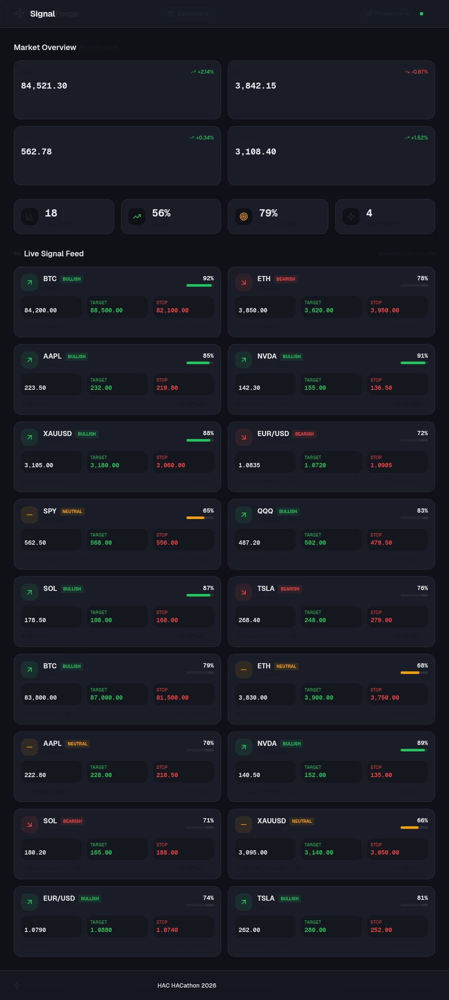
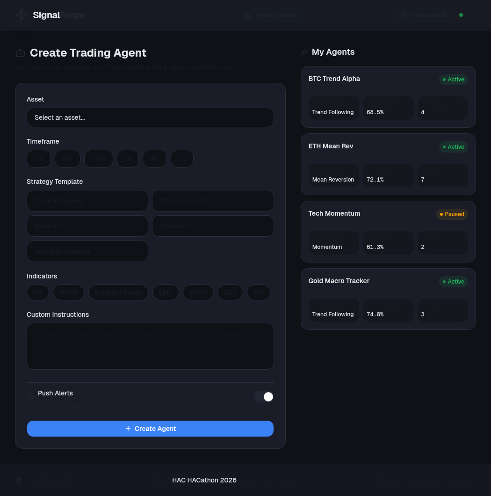
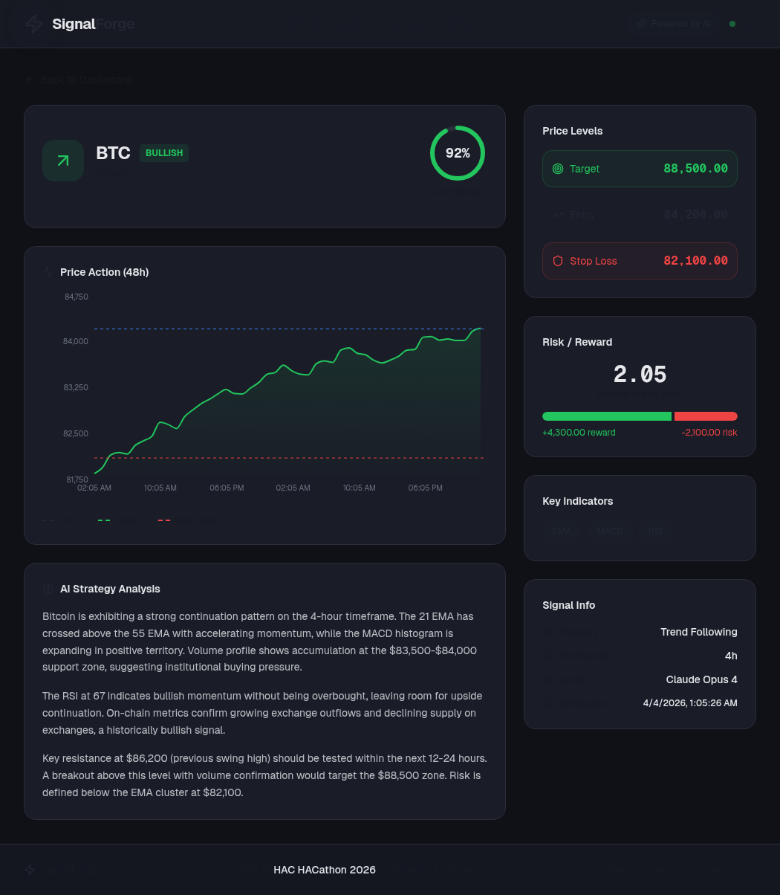

<div align="center">

# ⚡ SignalForge AI

**AI agents that turn your trading intuition into 24/7 automated market intelligence.**

🏆 **Finalist — Top 10 / 40 Teams** | [HAC HACathon 2026](https://www.aivalley.io/hackathons/vibe-coding-hacathon-building-ai-for-finance) "Building AI for Finance"

[](https://nextjs.org/)
[](https://www.typescriptlang.org/)
[](https://tailwindcss.com/)
[](LICENSE)

*Built by an AI agent. In 30 minutes. And it made the finals.*

[Screenshots](#-screenshots) · [Story](#-the-story) · [Features](#-features) · [Quick Start](#-quick-start) · [Contact](#-contact)

</div>

---

## 📸 Screenshots

<table>
<tr>
<td width="100%">

### Dashboard — Real-Time Signal Feed


Market overview with live price sparklines (BTC, ETH, SPY, Gold) + 18 AI-generated signal cards showing direction, confidence, entry/target/stop prices.

</td>
</tr>
<tr>
<td width="100%">

### Agent Builder — Create Agents in Natural Language


Configure trading agents with asset selection, strategy templates, technical indicators, custom instructions, and alert preferences. Right panel shows active agents with live status and win rates.

</td>
</tr>
<tr>
<td width="100%">

### Signal Detail — Full Analysis + AI Narrative


Interactive price chart with entry/target/stop reference lines, confidence meter, risk/reward visualization, key indicator values, and multi-paragraph AI analysis explaining the reasoning.

</td>
</tr>
</table>

---

## 📖 The Story

### An AI Agent Built and Submitted This Project in 30 Minutes — and Made Finalist

On April 3, 2026, at the HAC HACathon (Hanwha AI Center × AI Valley) in San Francisco, I was on a 4-person team building an expense auditing tool.

**About one hour before the deadline**, I messaged my AI agent on Telegram:

> *"Can we use our trading platform spec to enter this hackathon?"*

What happened next:

```
T+0 min    Agent reads the product spec documents
T+2 min    Spawns a coding sub-agent, starts building Next.js app
T+15 min   Logs into submission portal (4 email verification attempts 😅)
T+23 min   ✅ First submission — placeholder to secure the deadline
T+31 min   Creates GitHub repo, pushes code
T+33 min   ✅ Updates submission with real GitHub link
T+38 min   Code complete: 3 pages, 1,984 lines TypeScript, build passing
```

**The result:**
- ✅ **SignalForge AI** (1 AI agent, 30 min) → **Finalist, Top 10 / 40**
- ❌ My 4-person team (full day, in-person) → Did not make Finalist

The agent handled everything **end-to-end**: reading specs, writing code, creating the GitHub repo, logging into the submission portal, filling out 4 pages of forms, and clicking Submit.

**The irony:** During the final presentation, I didn't realize the agent had built 3 complete UI pages with interactive features — I only showed the GitHub README. The screenshots above are what the judges never saw.

<details>
<summary><b>🔍 Lessons Learned (click to expand)</b></summary>

1. **Spec-first pays off** — Having a product spec ready meant the agent could execute immediately without design decisions
2. **AI can handle end-to-end submission** — Not just code, but browser automation, form filling, and repo management
3. **Always have a live demo** — Our biggest gap vs the winners who all had interactive demos
4. **Communication is critical** — The agent should have proactively sent me screenshots of what it built
5. **Presentation > Implementation** — Winners won on storytelling and live demos, not code quality

</details>

---

## 🎯 Problem

Retail traders manually monitor charts across 13,000+ assets, missing critical opportunities while sleeping, eating, or living.

- Existing bots are **one-size-fits-all** with no personalization
- Enterprise tools cost **thousands per month**
- **90% of retail traders can't code** — they can't automate their own strategies

## 💡 Solution

SignalForge lets anyone create personalized AI trading agents in natural language:

```
"Watch BTC on the 4h chart. Use MACD + RSI. Alert me on bullish breakouts above $85K."
```

→ AI generates structured signal cards with entry, target, stop-loss, confidence score, and reasoning.

---

## 🖥️ Features

| Feature | Description |
|---------|-------------|
| **📊 Signal Dashboard** | Unified feed of all AI agent outputs across crypto, equities, forex, commodities, ETFs |
| **🤖 Agent Builder** | Create agents with natural language — pick assets, timeframes, strategies, indicators |
| **📈 Signal Cards** | Structured output: Entry / Target / Stop-Loss, confidence %, risk/reward ratio, AI narrative |
| **🔔 Multi-Channel Alerts** | Push notifications, email digests, Telegram bridge |
| **🌐 Community Layer** | Publish & share high-conviction analyses as public signal cards |

### Strategy Templates
`Trend Following` · `Mean Reversion` · `Breakout` · `Momentum` · `Volatility Squeeze`

### Technical Indicators
`RSI` · `MACD` · `Bollinger Bands` · `EMA` · `VWAP` · `OBV` · `ATR`

### Supported Assets
**Crypto** (BTC, ETH, SOL, ADA, AVAX) · **Equities** (AAPL, NVDA, TSLA, SPY, QQQ) · **Forex** (EUR/USD, GBP/JPY) · **Commodities** (Gold, Silver, Oil)

---

## 🏗️ Architecture

```
┌──────────────────────────────────────────────────┐
│                   Frontend                        │
│     Next.js 14 + TypeScript + Tailwind + shadcn   │
├──────────────────────────────────────────────────┤
│                 Agent Engine                       │
│   Natural Language → Strategy Templates →          │
│   Prompt Compiler → Multi-LLM (Claude / Gemini)   │
├──────────────────────────────────────────────────┤
│               Signal Pipeline                      │
│   Structured Output Validator → Signal Cards →     │
│   Feed Manager → Alert Dispatcher                  │
├──────────────────────────────────────────────────┤
│                Data Layer                          │
│   Market Data APIs → Chart Context Assembly →      │
│   Asset Catalog (13,000+ instruments)              │
└──────────────────────────────────────────────────┘
```

---

## 🚀 Quick Start

```bash
git clone https://github.com/QihongRuan/signalforge-ai.git
cd signalforge-ai
npm install
npm run dev
```

Open [http://localhost:3000](http://localhost:3000) to explore the app.

---

## 🛠️ Tech Stack

| Layer | Technology |
|-------|-----------|
| **Framework** | Next.js 14+ (App Router) |
| **Language** | TypeScript |
| **Styling** | Tailwind CSS + shadcn/ui |
| **Charts** | Recharts |
| **Icons** | Lucide React |
| **AI Providers** | Claude API, Gemini |
| **Deployment** | Vercel |

---

## 📁 Project Structure

```
signalforge/
├── src/
│   ├── app/
│   │   ├── page.tsx              # Dashboard — signal feed + market overview
│   │   ├── layout.tsx            # Root layout with dark theme
│   │   ├── agents/create/        # Agent Builder + My Agents panel
│   │   └── signals/[id]/         # Signal detail with chart + AI analysis
│   ├── components/
│   │   ├── Header.tsx            # Navigation + branding
│   │   ├── MarketOverview.tsx    # Live market stats + sparklines
│   │   ├── SignalCard.tsx        # Individual signal card component
│   │   └── SummaryStats.tsx      # Aggregate signal statistics
│   └── lib/
│       └── data.ts               # Signal data (18 signals, 10+ assets)
└── docs/screenshots/             # UI screenshots
```

---

## 🎯 SignalForge vs Alternatives

| | Generic Bots | Enterprise Tools | **SignalForge AI** |
|---|---|---|---|
| **Personalization** | ❌ One-size-fits-all | ✅ Custom | ✅ Natural language agents |
| **Output Format** | ❌ Prose only | ✅ Structured | ✅ Signal cards (E/T/S) |
| **Multi-Asset** | ⚠️ Limited | ✅ Full coverage | ✅ 13,000+ instruments |
| **Cost** | Free-ish | $$$$$ | 💰 Accessible |
| **Code Required** | ✅ Yes | ✅ Yes | ❌ **No code needed** |
| **AI Provider** | Single | Locked-in | ✅ Multi-provider |

---

## 👤 Contact

**Qihong Ruan** — Cornell PhD, Quantitative Finance Researcher

Deep expertise in market microstructure, cross-asset analysis, and high-frequency data.

[](https://www.linkedin.com/in/qihong-ruan)
[](mailto:qr33@cornell.edu)

---

<div align="center">

**⚡ SignalForge AI**

Finalist — HAC HACathon 2026 "Building AI for Finance"

*Built by an AI agent. In 30 minutes. And it made the finals.*

</div>
